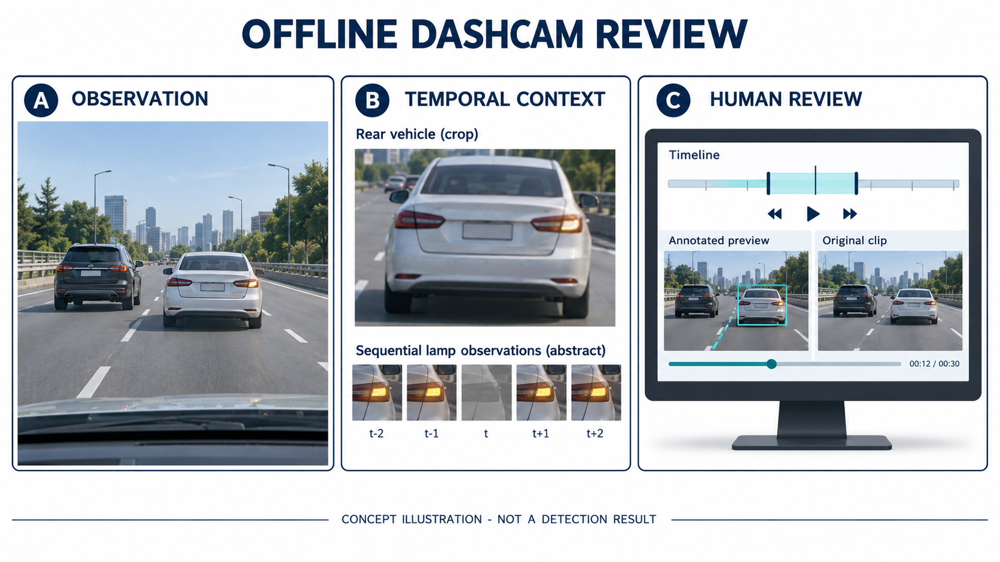
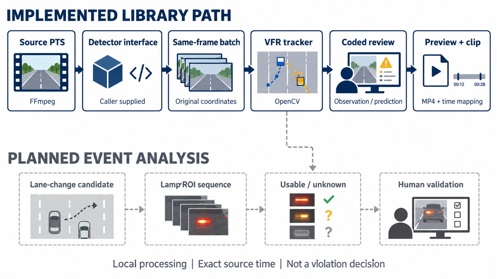
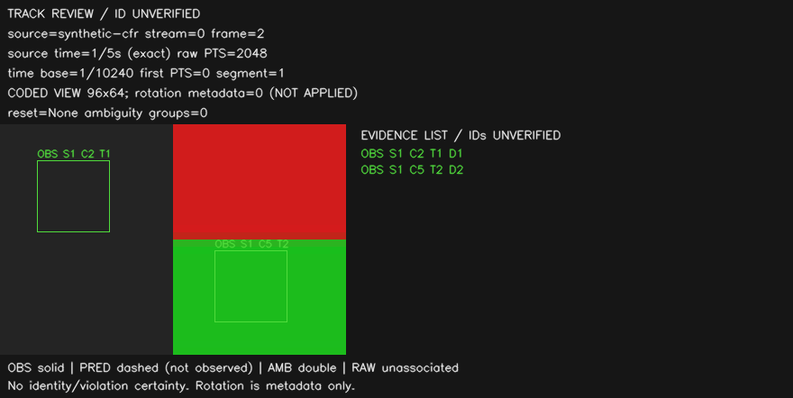
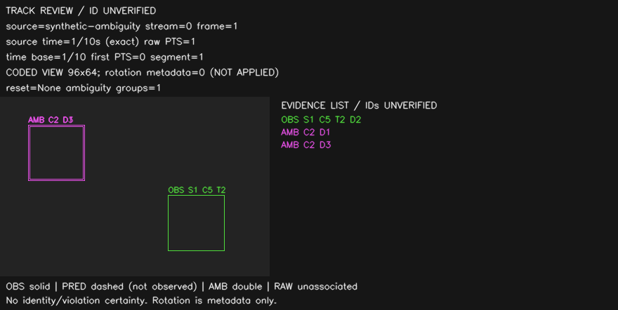

# cheating-racer-detect

### Source-Time-Preserving Dashcam Review

원본 시각과 관측 근거를 보존하는 블랙박스 분석·검토 연구 프로토타입.

## Abstract

이 프로젝트는 긴 주행 영상에서 차선 변경과 방향지시등 관측을 연결해 사람이 검토할 구간을 찾는 것을 목표로 합니다. 핵심은 단일 프레임의 점수가 아니라 같은 차량의 연속 관측, 정확한 원본 시각, 관측 불능의 구분입니다. 현재 Windows 클립 CLI와 모델 독립 탐지·추적·오버레이 라이브러리, 검토 MP4와 원본 클립의 시각 매핑을 제공합니다. 차선 변경·점멸 사건의 자동 판정과 실영상 정확도는 아직 미검증입니다.

**Keywords** — dashcam · variable frame rate · multi-object tracking · temporal observation · human review



*Figure 1. 목표 흐름의 AI 생성 개념 그림. 실제 주행 영상·탐지 결과·구현된 GUI가 아닙니다. 램프·타임라인은 설명용입니다.*

## 1. Problem and Scope

목표 흐름은 `영상 → 차량·차선 이력 → 변경 후보 → 램프 시계열 → 사람의 검토 → 클립 저장`입니다. 첫 평가 대상은 주간·맑음·전방 카메라에서 앞/대각선 앞 차량의 후면이 보이는 장면입니다. 야간·악천후를 영구 제외한다는 뜻은 아닙니다.

| 구분 | 현재 범위 |
| --- | --- |
| CLI | `doctor`, 원본 `[start,end)` 구간의 검토 클립 추출 |
| 분석 API | 같은 프레임의 탐지 계약·가변 dt 추적·관측/예측/모호성 요약·렌더링 |
| 검토 내보내기 | 무음 coded-view MP4·원본 클립의 음성/회전·프레임별 시각 매핑 |
| 후속 연구 | 차선 변경 후보·차량 기준 좌우·램프 점멸/관측 가능성·후보 자동 생성 |

미검출을 미점등으로 해석하지 않습니다. ID는 임시 추적 식별자이지 신원 정보가 아닙니다. 모델 점수·위치 예측은 위반 확률이나 실제 점멸 관측이 아닙니다.

## 2. System Overview



*Figure 2. AI 생성 구조도. 실선은 현재 라이브러리 경로, 점선은 후속 계획입니다. 탐지기는 호출자가 제공하며 아래 사건 분석과 화면 아이콘·예시 시각은 구현/측정 결과가 아닙니다. 점선 분기는 차량 이력을 후속 관측 가능성 분석에 전달하는 관계입니다.*

| 기술 | 역할 | 상태 |
| --- | --- | --- |
| Python | CLI·계약·작업 제어·원본/파생 결과 기록 | 구현 |
| FFmpeg / ffprobe | 컨테이너·PTS·디코딩·H.264/AAC 클립·검토 MP4 | 구현·합성 미디어 검증 |
| NumPy / OpenCV | 가변 dt 운동 모델·관측 연결·coded 오버레이 | 선택 의존성·native 검증 |
| PyTorch / YOLOX-s | 차량 탐지 추론 후보 | 로컬 실험, 최종 모델 미정 |
| 차선·램프 모델 | 차선 상대 위치·동일 차량 ROI 시계열 | 미구현·모델 미정 |

YOLOX는 anchor-free 탐지와 decoupled head를 제안합니다. YOLOX-s를 후보로 실험했지만 논문의 COCO 결과를 이 프로젝트의 주행 성능으로 전용하지 않습니다. [Ge et al., 2021](https://arxiv.org/abs/2107.08430)

## 3. Method

### 3.1 Source time and coordinates

시각은 평균 FPS가 아니라 정수 PTS와 time base로 정의합니다.

```math
t_i=(\mathrm{PTS}_i-\mathrm{PTS}_0)\,\mathrm{time\_base},\qquad
\Delta t_i=t_i-t_{i-1}.
```

`Frame`은 원본·스트림·디코딩 순서·PTS·첫 PTS·coded 크기·회전을 함께 보유합니다. 좌표는 원본 coded raster의 연속 half-open `xyxy`이며 display rotation은 분석 좌표에 적용하지 않고 메타데이터로 표시합니다.

640×640 top-left letterbox에서 정수 리사이즈 후 실제 축별 비율 `sx=resized_width/source_width`, `sy=resized_height/source_height`로 모델 공간 박스를 한 번만 역변환합니다. 패딩 전용 박스는 제외하며 이미 원본 좌표인 박스는 다시 변환하지 않습니다. row index·class·score와 모델 출처를 유지합니다. [분석 계약](cheating_racer_detect/analysis/contracts.py)

### 3.2 Variable-dt motion and association

운동 상태는 중심·로그 크기와 초당 속도로 구성합니다.

```math
z=[c_x,c_y,\log w,\log h]^T,\quad x=[z,\dot z]^T,\quad
A(\Delta t)=\begin{bmatrix}I_4&\Delta t I_4\\0&I_4\end{bmatrix}.
```

과정 잡음은 채널별 spectral density `q`에 대해 `q·dt³/3`, `q·dt²/2`, `q·dt` 블록을 사용합니다. 행렬은 프로젝트가 구성하고 수치 예측/보정은 OpenCV `KalmanFilter` API를 호출합니다. [운동 구현](cheating_racer_detect/tracking/motion.py), [OpenCV 공식 문서](https://docs.opencv.org/4.11.0/dd/d6a/classcv_1_1KalmanFilter.html)

같은 클래스의 IoU 후보 그래프에서 고유한 1:1 연결만 유지합니다. 모호/중복 연결은 해당 ID 이력을 끊고 독립 차량은 유지합니다. 낮은 점수는 정책에 따라 기존 연결만 허용하고 신규 ID에는 별도 문턱을 적용합니다. 만료는 프레임 수가 아니라 마지막 실제 관측 이후의 초 단위 시간입니다. 정책값은 실차 평가로 교정해야 합니다. [추적 구현](cheating_racer_detect/tracking/tracker.py)

```text
validate current frame, source coordinates and model receipt
compute exact source-time delta; predict motion
expire by last observed time; build same-class candidate components
associate unique pairs; terminate ambiguous histories
emit observed / prediction-only / unassociated records
```

### 3.3 Evidence-aware review

| 표시 | 의미 | 관측 근거 |
| --- | --- | --- |
| 초록 실선 · OBS | 현재 프레임의 연결된 관측 | detection bbox/index/score/model 유지 |
| 주황 점선 · PRED | 미관측 동안의 위치 예측 | 현재 detection/score/model null·관측 age 표시 |
| 자홍 이중선 · AMB | 고유 연결을 정하지 못한 raw 탐지 | ID 없음·개별 detection 유지 |
| 청록 실선 · RAW | ID와 연결되지 않은 raw 탐지 | ID 없음·raw 출처 유지 |



*Figure 3. 실제 렌더링한 합성 결과: CFR frame 2, 원본 1/5초. 자체 패턴 영상과 scripted post-NMS 박스이며 차량 모델의 실제 검출 결과가 아닙니다.*


*Figure 4. 실제 합성 결과: frame 3, 원본 3/10초. class 2는 현재 관측 없이 PRED이며 age는 1/10초입니다. 예측 박스를 램프 관측으로 사용할 수 없습니다.*



*Figure 5. 실제 합성 모호성 검증: 중복 class-2 박스는 ID 없이 유지되고 독립 class-5 관측은 보존됩니다. 겹친 박스도 개별 evidence 목록으로 확인합니다.*

### 3.4 Review video and original clip

[내보내기 API](cheating_racer_detect/review/video.py)는 같은 구간의 주석 영상과 원본 클립을 새 폴더에 함께 확정합니다. 검토 MP4는 첫 선택 프레임에서 0초로 시작하고 원본 PTS·정규화 시각·검토 PTS를 기록합니다. VFR 간격·마지막 duration을 유지하고 고정 캔버스에 렌더링한 뒤 재디코딩해 검증합니다. [FFmpeg 공식 문서](https://ffmpeg.org/ffmpeg.html)

```text
review-001/
├── review.mp4            # coded-view 오버레이, 무음
├── review.json           # 원본 ↔ 검토 시각·관측 근거
└── original/
    ├── clip.mp4          # 주석 없는 재인코딩 구간, 해당 음성·회전
    └── result.json       # 원본 해시·요청/실제 구간·검증
```

검토 영상은 원본 증거를 대체하지 않습니다. 원본 클립과 coded-view 검토 영상의 방향이 다를 수 있습니다. 원본 클립은 요청 시작과 첫 프레임의 간격을 반영하고 검토 MP4는 첫 선택 프레임을 0으로 삼으므로, 비교에는 두 JSON의 원본 시각을 사용합니다.

## 4. Reproducibility

검증 환경: Windows · Python 3.13.13 · FFmpeg/ffprobe 9.0.2 Gyan essentials. 클립 CLI에는 GPU와 ML 패키지가 필요하지 않습니다.

### Clip CLI

```powershell
pwsh -NoProfile -File scripts/bootstrap.ps1 -DownloadTools
.\.venv\Scripts\python.exe -m cheating_racer_detect doctor
.\.venv\Scripts\python.exe -m cheating_racer_detect clip --input "D:\dashcam\input.mp4" --start 12.35 --end 19.8 --output "D:\dashcam\review-001"
```

경로를 자신의 파일로 바꾸세요. 출력 상위 폴더는 존재해야 하고 결과 폴더는 새 이름이어야 합니다. [설치 스크립트](scripts/bootstrap.ps1)는 다운로드한 FFmpeg의 고정 SHA-256을 검사하고 전역 PATH·드라이버를 변경하지 않습니다. 기존 도구에는 `--ffmpeg-dir` 또는 `CRD_FFMPEG_DIR`를 지정할 수 있습니다.

### Analysis API and synthetic demo

NumPy/OpenCV는 선택 의존성입니다. 별도 환경에서 `python -m pip install ".[tracking]"`으로 준비할 수 있으며 기본 CLI·순수 계약/summary에는 필요하지 않습니다. 아래 탐지기와 정책은 호출자가 준비합니다. 모델 자동 로딩·다운로드·자동 영상 분석 명령은 제공하지 않습니다.

```python
from cheating_racer_detect.analysis import DetectorTrackerBridge
from cheating_racer_detect.review import export_review
from cheating_racer_detect.tracking import Tracker

bridge = DetectorTrackerBridge(
    detector, Tracker(policy),
    model_alias="vehicle-model-v1", expected_detector_id=detector.model_id,
)
export_review(
    "input.mp4", "12.35", "14.8", "review-001",
    observe=lambda frame, bgr: bridge.update(frame, bgr)["tracking"],
)
```

`detector.detect(frame, readonly_bgr_array)`는 현재 Frame·원본 좌표의 DetectorObservation·Letterbox·모델 식별자가 담긴 DetectorBatch를 반환해야 합니다. 모델 공간의 YOLOX Nx7 결과에는 `post_nms_observations`를 한 번 적용합니다. 작업 실패/취소 후 callback의 상태를 재사용하려면 명시적으로 초기화하세요.

동일 환경에서 [합성 데모](scripts/demo_review.py)를 실행할 수 있습니다. 정답 박스를 주입하는 예제이며 모델 탐지 데모가 아닙니다.

```powershell
python -m scripts.demo_review --profile vfr --output "D:\review-demo-001"
python -m unittest discover -s tests -v
```

### Input and resource limits

| 항목 | 지원 범위 |
| --- | --- |
| 미디어 | 단일 로컬 MP4·H.264 8-bit 4:2:0 SDR 1개·AAC 0~1개 |
| 클립 구간 | 첫 원본 비디오 PTS 기준 `[start,end)`·CFR/VFR·시작 offset·90도 단위 회전 |
| 분석 연결 | 원본 축 ≤1024·640×640 letterbox·프레임당 탐지 ≤64 |
| 검토 MP4 | 선택 프레임 ≤120·원본 축 ≤1024·제한된 time base·무음 coded view·고정 짝수 캔버스 |
| 결과/복구 | 원본·기존 결과 덮어쓰기 금지·오류/취소 시 소유 임시 자원 정리 |

HEVC·HDR·다중 비디오/자막/데이터 트랙·분할 파일 결합·네트워크/재분석 지점·상위 경로(`..`)는 지원하지 않습니다. 마지막 포함 프레임의 표시 길이는 요청 끝을 넘을 수 있습니다. 강제 종료 후에는 해당 작업의 `.crd-*.partial`만 확인하고 새 이름으로 재시도하세요. 현재 전체 원본을 여러 번 읽고 디코딩하므로 장시간 성능은 검증이 필요합니다.

## 5. Experimental Validation

검증은 프레임/시각·관측 출처·출력 보존·복구에 대한 기능 시험입니다. 차선 변경/방향지시등 탐지 정밀도·재현율을 측정한 결과가 아닙니다.

| 실험 | 결과 | 해석 |
| --- | --- | --- |
| 공개 테스트 | 162개 PASS | CLI·추적·연결·render·MP4/원본 clip·그림 출처 검사 |
| 검토 MP4 | CFR/VFR/offset/90·180·270 회전·단일 프레임·음성 | 실제 FFmpeg/OpenCV·독립 ffprobe PTS/마지막 duration·픽셀·원본 불변 대조 |
| 연결/프레임 preview | 6종 자체 영상 162프레임 + 모호성 사례 | scripted boxes → native tracking/render; 실차 모델 정확도 아님 |
| 로컬 모델 연결 | YOLOX-s/RTX2070·합성 입력 18프레임 | 차량 검출 0개: empty 연결 경로만 확인, positive 성능 미검증 |
| 실패/복구 | 입력·기록·native/encode 실패·취소·출력 충돌·재시도 | 원본/기존 결과 보존과 소유 임시 자원 정리 |

FFmpeg 또는 NumPy/OpenCV가 없으면 실제 엔진 테스트가 건너뛰어집니다. skip이 있는 실행을 전체 검증으로 볼 수 없습니다. 수동 플레이어·사용자 터미널·업무 수락은 아직 남아 있습니다. [그림 출처와 생성 프롬프트](assets/figures/provenance.json)는 유형·해시·원본 구현 revision을 구분합니다.

## 6. Limitations and Planned Work

차선 상대 위치·자차 이동·곡선/합류, 차량 기준 램프 좌우, 가림·반사광·브레이크등·비상등·해상도 부족을 다뤄야 합니다. 후속 램프 분석은 실제 관측 ROI의 시간 이력과 관측 가능성을 분리하는 방향입니다. 생성/복원 이미지나 위치 예측으로 불빛을 만들어 근거로 사용하지 않습니다. 관련 연구는 설계 참고이며 해당 모델은 아직 구현/채택하지 않았습니다. [Frossard et al., 2019](https://arxiv.org/abs/1905.01333)

실영상의 이벤트 정밀도/재현율·unknown/커버리지·ID 교환·처리 시간·RAM/VRAM, 연속 파일과 사용자 검토 효과는 미검증입니다. 패키지 빌드·fresh install·다른 OS/GPU·최종 모델/가중치 배포도 별도 검증 대상입니다. 자동 신고나 법적 위반 확정을 제공하지 않습니다. 프로젝트 라이선스는 미정입니다.

## References

1. Ge, Z., Liu, S., Wang, F., Li, Z., & Sun, J. (2021). [YOLOX: Exceeding YOLO Series in 2021](https://arxiv.org/abs/2107.08430). arXiv:2107.08430. 탐지 후보의 원저자 설명.
2. Frossard, D., Kee, E., & Urtasun, R. (2019). [DeepSignals: Predicting Intent of Drivers Through Visual Signals](https://arxiv.org/abs/1905.01333). 램프 신호·시간 맥락의 설계 참고.
3. OpenCV 4.11.0. [cv::KalmanFilter](https://docs.opencv.org/4.11.0/dd/d6a/classcv_1_1KalmanFilter.html). 현재 수치 예측/보정 API.
4. FFmpeg. [Command-line documentation](https://ffmpeg.org/ffmpeg.html), [setpts / settb](https://ffmpeg.org/ffmpeg-filters.html#setpts_002c-asetpts), [setts](https://ffmpeg.org/ffmpeg-bitstream-filters.html#setts). 시각·time base·MP4 검증의 기술 참고.
